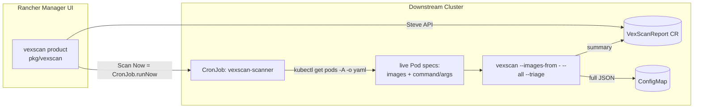

# rancher-vexscan-extension

A Rancher Manager UI extension for [vexscan](https://github.com/cwayne18/vexscan):
in-cluster, VEX-backed CVE presence/reachability triage, scoped to this
cluster's actual, live running workloads - RKE2's own images and everything
else deployed alongside them.

It's the same idea as `kubectl get pods -A -o yaml | vexscan --images-from -`
or `contrib/vexscan-dashboard.py` in the main vexscan repo, but instead of a
one-off local command and a static HTML file you email around, the scan runs
on a schedule inside the cluster and the results show up natively in Rancher
- in the left nav, next to Fleet, Apps, Cluster Explorer, etc.

> **Status:** design scaffold / mockup. The extension package builds and
> installs (see below), but the backend chart and scanner image have not been
> published yet - this repo documents and scaffolds the full architecture so
> it can be built out incrementally.

## Why live pod state, specifically

The scanner pipes `kubectl get pods -A -o yaml` straight into `vexscan
--images-from -` - vexscan's own recommended pattern for scanning a live
cluster (it recognizes the `kind: List` of `Pod` documents it gets back and
reads every container's image). That has two real advantages over scanning a
static image list:

- **No outbound network dependency.** An earlier version of this scanner
  resolved the node's kubelet version (which, on an RKE2 node, *is* that
  release's exact tag, e.g. `v1.30.4+rke2r1`) and downloaded that release's
  image manifest from the `rke2` GitHub release. That worked, but required
  egress to github.com from inside the cluster - a non-starter for the
  air-gapped clusters this kind of compliance scanning is often run on - and
  only ever covered RKE2's own images, missing everything else actually
  deployed (ingress controllers, cert-manager, user workloads, other system
  charts, etc).
- **More accurate reachability.** Unlike a plain image reference, a live Pod
  spec also carries each container's `command:`/`args:` override. A
  container's declared image `ENTRYPOINT` isn't necessarily what's actually
  running - e.g. `rancher/hardened-calico`'s image entrypoint is `bash`, but
  the real pod runs `command: [/usr/bin/calico-node]`. Scanning the image
  alone would wrongly treat bash's whole closure as reachable; reading the
  manifest tells vexscan the truth about what's actually started.

The report still records the cluster's RKE2 build (read from kubelet
version) as an informational label, but it no longer determines what gets
scanned - upgrade the cluster, and the next scheduled scan picks up whatever
images are actually running post-upgrade, same as any other change to the
live fleet.

## Architecture



Two halves, each in this repo:

1. **`pkg/vexscan/`** - the actual Rancher Dashboard UI extension (Vue 3 +
   `@rancher/shell`), scaffolded with the official `@rancher/extension`
   generator. Adds a cluster-scoped "VEX Scan" product with:
   - an **Overview** page: RKE2 version, last scan time, severity summary
     cards, per-image findings table, and a **Scan Now** button.
   - a generic CRD list/detail view for `VexScanReport` objects (reusing
     Rancher's built-in generic resource pages - no bespoke list/detail
     plumbing needed for that part).
   - the nav entry only appears in clusters where the `vexscan.cattle.io`
     CRD group is actually installed (`ifHaveGroup`, the same pattern
     `rancher-gatekeeper` uses), so it doesn't show up on clusters that
     haven't installed the chart below.

2. **`charts/vexscan-scanner/`** + **`scanner/`** - the in-cluster backend.
   A small Helm chart (installable standalone, via Rancher Apps, or via
   Fleet) that creates:
   - the `VexScanReport` CRD (`vexscanreports.vexscan.cattle.io`)
   - RBAC (`ServiceAccount` + `ClusterRole`/`ClusterRoleBinding` for reading
     node versions and the CRD; a namespaced `Role`/`RoleBinding` for writing
     the results `ConfigMap`) for the **scanner itself**
   - a `CronJob` (default: daily) running `scanner/entrypoint.sh` in a small
     image built on top of the real `ghcr.io/cwayne18/vexscan` image

   Install this on **each downstream RKE2 cluster** you want scanned.

3. **`rancher/roletemplates.yaml`** - two Rancher `RoleTemplate`s
   (`vexscan-view`/`vexscan-operate`) for **end users** - see "End-user
   RBAC" below. Apply this **once, to the Rancher server's own management
   cluster** (not to any downstream cluster - `RoleTemplate` is a
   Rancher management-plane CRD that only exists there).

### "Scan Now" doesn't need a custom backend action

The UI's "Scan Now" button does **not** call any bespoke server-side API.
Rancher Dashboard already ships a working `runNow()` action on `batch.cronjob`
resources (`shell/models/batch.cronjob.js`): it clones the CronJob's
`spec.jobTemplate` into a new one-shot `Job`, owned by the CronJob, and saves
it - exactly what you get from Workloads > CronJobs > (kebab) > **Run Now** in
stock Rancher. `pages/overview.vue` just fetches the `vexscan-scanner`
CronJob this chart created and calls `cronJob.runNow()`. No custom Steve
action or new backend endpoint - but the calling user still needs real
Kubernetes RBAC to create a `Job`/patch the `CronJob`, same as clicking
Run Now anywhere else in Rancher. See "End-user RBAC" below for how that's
granted.

### End-user RBAC

Rancher's own default per-cluster roles (`cluster-owner`/`cluster-member`/
read-only) don't automatically cover a custom CRD or a chart's own system
namespace, so without anything extra, only `cluster-owner` (full cluster
admin) could see a `VexScanReport` or click Scan Now. `rancher/roletemplates.yaml`
defines two `management.cattle.io/v3` `RoleTemplate`s instead, so a
cluster-owner can delegate narrower access from **Cluster > Users &
Permissions**, the same place they'd assign any other Rancher role.

**Apply that manifest once to the Rancher server's own management cluster**
(commonly called `local` - the cluster Rancher Manager itself runs on), e.g.:

```sh
kubectl --context <rancher-server-context> apply -f rancher/roletemplates.yaml
```

Not to each downstream cluster - `RoleTemplate` only exists as an API type
on the cluster running Rancher Manager (confirmed live: installing it via
the `vexscan-scanner` chart on a downstream cluster fails with
`no matches for kind "RoleTemplate" in version "management.cattle.io/v3"`,
since that CRD/API group simply isn't there). Once applied to the Rancher
server, a cluster-owner on any Rancher-managed downstream cluster can assign
these roles - a `RoleTemplate` only needs to exist once to be assignable
everywhere Rancher manages.

| RoleTemplate       | Grants                                                                 |
| ------------------ | ----------------------------------------------------------------------|
| `vexscan-view`     | Read `VexScanReport` status (triage bucket/severity counts, phase) and the full `report.json.gz` ConfigMaps. No scan trigger. |
| `vexscan-operate`  | Everything in `vexscan-view`, plus create the `Job`/patch the `CronJob` needed for "Scan Now" (composed via `roleTemplateNames: [vexscan-view]`, not duplicated). |

`pages/overview.vue` checks `cluster/canCreate`/`cluster/canUpdate` on the
Job/CronJob types and disables "Scan Now" with an explanatory tooltip/banner
for `vexscan-view`-only users, instead of letting them click into a 403.

**Known limitation**: a `context: "cluster"` RoleTemplate compiles down to a
`ClusterRoleBinding`, so (consistent with how Rancher's own built-in cluster
roles work) the ConfigMap/Job/CronJob rules above are granted cluster-wide,
not scoped to just the `cattle-vexscan-system` namespace the chart installs
into. An admin wanting tighter per-namespace isolation should put that
namespace in its own Rancher Project and use a `context: "project"` variant
instead. Not yet validated against a live Rancher Prime cluster - see
"Validation status".

### Rancher Prime gating

vexscan is intended to be Prime-exclusive. Enforcement is layered, from
cosmetic to real:

1. **UI soft gate (implemented)** - `pages/overview.vue` calls the real
   `isRancherPrime()` helper from `@shell/config/version` (populated from
   the server's own `/rancherversion` API response) and shows a blocking
   banner/disables Scan Now when the connected server isn't Prime. This is
   a courtesy for anyone who installs the chart against a Community server;
   it does **not** stop them, since it's just JS shipped to the browser.
2. **Backend gate (not implemented)** - `scanner/entrypoint.sh` could make
   the same check server-side and fail the Job/CronJob outright. Harder to
   bypass than (1), but still just removable source.
3. **Distribution gate (not implemented, the one that actually matters)** -
   don't publish the chart/scanner image to a public registry or catalog at
   all; host both in a SUSE/Rancher support-entitlement-gated registry, the
   same pattern Rancher Prime's own hardened images already use. Access
   itself requires an active subscription, regardless of what the shipped
   code does or doesn't check.
4. **Bundle into Prime itself (not implemented)** - ship vexscan as a
   pre-registered extension inside the Rancher Prime server chart/image
   directly, so a Community Rancher install never has it to install in the
   first place. Closest to "bundled into Rancher Manager" as originally
   envisioned.

(1) is implemented in this repo. (2)-(4) are distribution/packaging
decisions outside a single extension repo's code and aren't done here.

### Why a CRD status summary + separate ConfigMap, not one big object

`VexScanReport.status` only holds summary severity/bucket counts and a small
`componentResults[]` list (one row per scanned image: name, finding count, and
a pointer to a ConfigMap). The full `vexscan --format json` output is written
to that ConfigMap instead of inline in the CR, so a big cluster doesn't risk
tripping etcd's per-object size limit. This mirrors the summary/detail split
used by tools like the Trivy Operator.

Validated against a real scan: 3 RKE2 component images alone produced a
3.4MB raw JSON report, far past the 1MiB hard limit the apiserver enforces on
ConfigMaps/Secrets. Seeing exactly what was ruled out, and why, is core to
what vexscan's triage is for, so `entrypoint.sh` never drops a whole status
bucket to save space. Instead it degrades in stages, gzipped throughout
(JSON compresses very well here - about 27x on real data):

1. the full report, as-is.
2. the full report with only the bulky per-finding `evidence` chains
   stripped (confirmed: ~190/2372 findings carried one on real data,
   accounting for over half the raw bytes - every finding and bucket is
   still present, just without the deepest forensic detail).
3. (last resort) capped to the top N findings per *status bucket*
   (affected/vexed/ruledOut/undetermined), ranked by severity within each
   bucket, so every bucket keeps representation instead of any one being
   zeroed out.

`status.summary`'s counts are never truncated at any stage, and any
degradation is recorded in `status.message`.


## Repo layout

```
pkg/vexscan/              Rancher Dashboard extension package
  product.ts               nav entry, CRD list columns, ifHaveGroup gating
  routing/                 Overview page route + reused generic CRD routes
  pages/overview.vue        dashboard: version, severities, table, Scan Now
  detail/...scanreport.vue  per-report detail view
  models/...scanreport.ts   typed getters over the CR's spec/status
  l10n/en-us.yaml           UI copy
  config/constants.ts       product/type name constants shared across files

charts/vexscan-scanner/   Helm chart for the in-cluster backend
  crds/                     VexScanReport CRD
  templates/                namespace, RBAC, CronJob

rancher/                  Manifests for Rancher's own management cluster
  roletemplates.yaml        end-user RoleTemplates (apply once, to Rancher
                            server - see "End-user RBAC")

scanner/                  Scanner container
  entrypoint.sh             kubectl get pods -> vexscan scan -> CR/ConfigMap write
  Dockerfile                built FROM ghcr.io/cwayne18/vexscan

hack/                     Dev-only scripts (local RKE2 test cluster, etc.)

mockup/                   Static, self-contained HTML mockup of the Overview
                          page (no Rancher/K8s needed to view it)
```

## Trying the extension UI

Requires Node v24+ and Yarn (the official extension tooling's requirement).

```sh
yarn install
yarn dev    # runs the dev-app shell at http://localhost:8005, pointed at a real Rancher API
```

Or build the package to load into an existing Rancher via Developer Load /
the Extensions catalog:

```sh
yarn build-pkg vexscan
```

## Trying it end-to-end against a real RKE2 cluster

`hack/local-rke2-test.sh` spins up a single-node RKE2 cluster in a Multipass
VM, builds `vexscan-scanner` locally (no GHCR dependency), loads it into the
VM's containerd, installs the chart, and runs a manual scan - useful for
exercising the real scanner + `VexScanReport` CR without a cloud cluster.
Requires Docker, Multipass, Helm, kubectl and Go on your machine:

```sh
./hack/local-rke2-test.sh
```

See the script header for env var overrides and cleanup instructions. Note
that Rancher's own embedded "local" management cluster is k3s, not RKE2, so
it can't be scanned itself - this script's VM (or any other real downstream
RKE2 cluster) is what the scanner actually needs.

## Trying the mockup

`mockup/dashboard.html` is a static, self-contained preview of the Overview
page's look - open it directly in a browser, no build step or cluster
required.

## Validation status

This has now been run end-to-end against a real RKE2 cluster (chart
installed via `helm`, scanner image built/pushed and imported via
`docker save | ctr image import`, CronJob and manual `Job` runs, and the
extension viewed live via Rancher's UI). What's been validated for real vs.
what's still a known gap:

**Validated against a real cluster**:
- `vexscan` requires `skopeo` on `PATH` and a `/etc/containers/policy.json`
  trust policy to pull images - both were missing from the original
  `scanner/Dockerfile` and are now fixed.
- `kubectl get pods -A -o yaml | vexscan --images-from -` against a real
  cluster's live pod state, including the `PIPESTATUS`-based error handling
  for a `kubectl` vs. `vexscan` failure.
- The real batch JSON schema (`schema_version`/`mode`/`targets`/`results[]`,
  uppercase `severity`, finding `status` vocabulary, `vex` sub-object shape).
- `entrypoint.sh`'s `jq` summary/bucket logic, run against real report JSON -
  counts reconcile exactly against the raw finding counts. This also
  surfaced and fixed a real `jq --argjson` bug (empty/invalid JSON for one
  of the piped-in values needs the same `jq -e .` validate-or-default
  pattern already used elsewhere, not just the happy path).
- The raw-report-vs-ConfigMap-size-limit problem described above, and the
  staged gzip/strip/cap fix, measured against real output (including
  confirming every status bucket keeps representation even under an
  artificially tiny size limit).
- CRD admission, `--subresource status` patch semantics, CronJob/manual-Job
  scheduling, and the ServiceAccount's RBAC, all against a live cluster.
- The full UI, via Rancher's real Steve API against a live cluster - this
  caught (and fixed) four separate bugs: a wrong Steve resource type string,
  two Vue/Rancher-API misuses (`cluster/canCreate`/`canUpdate` don't exist
  as store getters; `this.$allHash` doesn't exist as an instance method) that
  crashed or silently no-opped page rendering, and a TypeScript
  `useDefineForClassFields` field-declaration bug that wiped out `spec`/
  `status` data right after the model object was constructed.

**Still a known gap**: no automated test suite (CI, unit, or e2e) - all
validation so far has been manual, interactive testing against one real
cluster. A `context: "project"` RoleTemplate variant for tighter
per-namespace RBAC isolation (see above) hasn't been built or tested.

## Relationship to the vexscan CLI and contrib/ scripts

| | `vexscan` CLI | `contrib/vexscan-dashboard.py` | this extension |
|---|---|---|---|
| Runs | wherever you invoke it | local, one-off | scheduled, in-cluster |
| Image list | you provide it | you provide it | resolved automatically from the cluster's live pod state |
| Output | stdout / file | one static HTML file | live CR + ConfigMap, browsable in Rancher |
| Re-scan | re-run manually | re-run manually | scheduled, or one click ("Scan Now") |
